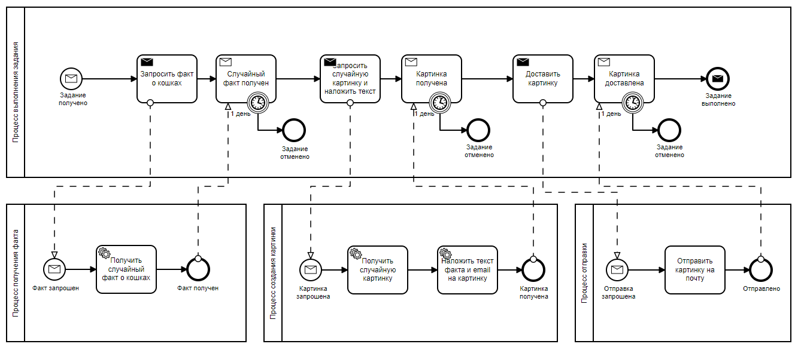
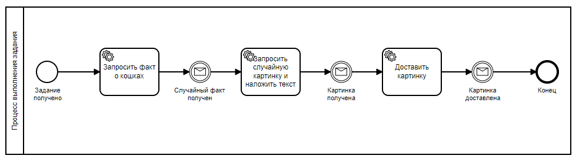

# Финальное задание курса 2307: Camunda для оркестрации микросервисов

## Архитектура

**Механизм связи**:

* **[Apache Kafka](services/)** как шина событий (можно легко изменить на обмен сообщениями, например, RabbitMQ);
* **[REST](services/image-camunda/src/main/java/org/zimin/image/rest/)** связь между сервисами.

**Движок бизнес процесса**:

* **Camunda Platform**
* **Zeebe**

**Язык программирования**:

* **Java**
* **JavaScript**

### Вариант с Camunda 7:



### Вариант с Camunda 8:



Чтобы запустить сервисы необходимо перейти в директорию runner и выполнить:

```
docker-compose up -d
```

Чтобы запустить версию с Camunda 8 необходимо перейти в директорию runner и выполнить:

```
docker-compose -f docker-compose-camunda-8.yml up -d
```

Затем перейти в браузере по адресу:

```
http://localhost:8099
```

Чтобы посмотреть логи выполнить команду:

```
docker-compose logs -f
```


