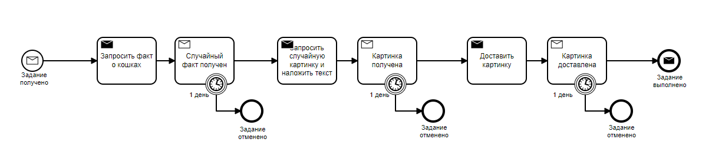

# Финальное задание курса 2307: Camunda для оркестрации микросервисов

## Архитектура

**Механизм связи**:

* **[Apache Kafka](services/)** как шина событий (можно легко изменить на обмен сообщениями, например, RabbitMQ);
* **[REST](services/image-camunda/src/main/java/org/zimin/image/rest/)** связь между сервисами.

**Движок бизнес процесса**:

* **Camunda Platform**

**Язык программирования**:

* **Java**
* **JavaScript**

*Процесс заданий:*


*Процесс получения факта:*


*Процесс создания картинки:*


Чтобы запустить сервисы необходимо перейти в директорию runner и выполнить:

```
docker-compose up -d
```

Чтобы посмотреть логи выполнить команду:

```
docker-compose logs -f
```


